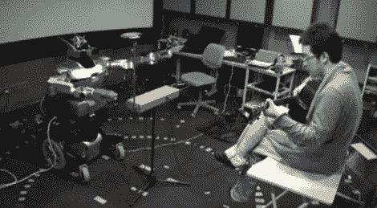

# 人形机器人听音乐，弹奏特雷门琴

> 原文：<https://hackaday.com/2011/07/08/humanoid-robot-listens-to-music-plays-along-on-his-theremin/>

研究人员和 YouTube 用户[mspetitegeek]和她的实验室伙伴[Tatsuhiko Itohara]有幸花了一些时间与来自 Kawada Industries 的 HRP-2 人形机器人一起工作。他们的研究似乎集中在使用机器人创造与人类的实时互动[以娱乐为目的，至少是](http://www.robots-dreams.com/2011/07/robot-plays-the-thermin-interactively-video.html)。

他们创建的程序允许 HRP-2 在人类弹奏吉他时听和看其对应物，以识别节拍模式。一旦机器人明白了，它就会跟着他的特雷门琴一起演奏，完美地匹配音符和节奏。由于人类操作员显然以相当放松的速度演奏，我们很想看到机器人需要配合更快曲调的演示——这可能非常有趣。

与此同时，我们满足于坐下来享受 HRP-2 摇动特雷门琴的魔怪乐队式音调。

请继续阅读，观看 HRP-2 的视频短片。

 <https://www.youtube.com/embed/-fuOdhMeF3Y?version=3&rel=1&showsearch=0&showinfo=1&iv_load_policy=1&fs=1&hl=en-US&autohide=2&wmode=transparent>

 </body> </html>