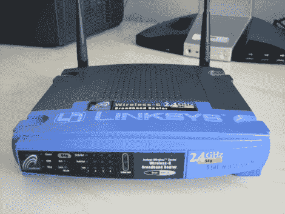

# 反向工程 VxWorks(在较新的路由器上取代 Linux)

> 原文：<https://hackaday.com/2011/07/08/reverse-engineering-vxworks-which-replaces-linux-on-newer-routers/>

看到的 Linksys 路由器是 WRT54G 版本 1。它运行 Linux 是出了名的，在全盛时期是许多黑客攻击的来源，导致了流行的替代固件包，如 DD-WRT 和番茄。但该公司从硬件版本 8 开始放弃了基于 Linux 的固件。现在他们正在使用一种叫做 VxWorks 的专有实时操作系统。

[Craig]最近为 WRT54Gv8 和更新的路由器编写了一份逆向工程指南。他的方法完全基于固件，因为他实际上没有运行 VxWorks 的路由器。稍微在十六进制转储中探索一下，就可以让他识别文件的不同部分，导致一个 ELF 头，真正开始解开其中的秘密。从那里，他执行一个相当长的过程，准确地将代码分解成有意义的东西。为此选择的工具是[IDA Pro disassembler 和调试器](http://www.hex-rays.com/idapro/)。我们以前并不熟悉它，但看到它的功能后，我们印象深刻。

[图片来自[维基共享资源](http://en.wikipedia.org/wiki/File:Linksys_WRT54G_V1.jpg)