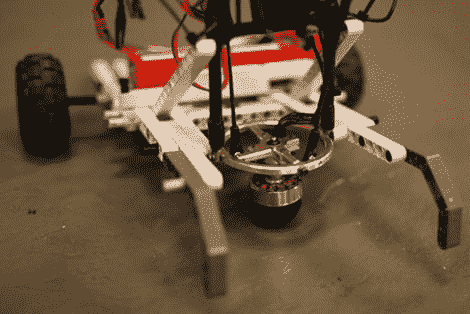

# 令人惊叹的半球形全向万向轮式机器人

> 原文：<https://hackaday.com/2011/07/09/amazing-hemispherical-omnidirectional-gimbaled-wheel-robot/>

布拉德利大学的研究生[柯蒂斯·博勒姆]制造了一个机器人，它使用了一种非常独特的驱动系统，我们猜测你以前从未见过这种驱动系统。这个机器人使用一个马达来驱动它的半球形全向万向轮，以惊人的速度和不可思议的敏捷推动它在地板上行走。

该机器人使用一个简单的双轴万向节进行移动，其中包含一个小型无刷遥控飞机电机。由于一对遥控伺服系统，电机高速旋转橡胶轮，推动机器人向任何方向移动。当伺服倾斜万向节，他们改变车轮的哪一侧接触地面以及齿轮减速，消除了对机械传动或传统转向机构的需要。

虽然他最初认为是他发明了这个概念，但[Curtis]发现这项技术已经有将近 100 年的历史了，但大多数人已经忘记了它。我们很确定这一次人们会记住它。看了我们在下面嵌入的演示视频后，你怎么能不喜欢呢？

我们认为这是一个很棒的概念，我们迫不及待地想看看其他机器人制造商如何利用这项技术。

[通过 [Gizmodo](http://gizmodo.com/5819161/youve-never-seen-a-robot-drive-system-like-this-before)

 <https://www.youtube.com/embed/uaT7M3Nwj7c?version=3&rel=1&showsearch=0&showinfo=1&iv_load_policy=1&fs=1&hl=en-US&autohide=2&wmode=transparent>

 </body> </html>