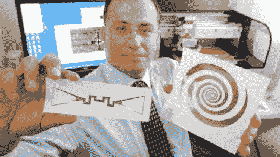

# 收集环境电磁能量

> 原文：<https://hackaday.com/2011/07/11/scavenging-ambient-electromagnetic-energy/>

此时此刻，看不见的无线电波正从你周围的几乎所有东西上反弹回来。从电台和电视台到手机网络和卫星，这些电波充满了未被利用的能量。[也就是直到现在。](http://www.sciencedaily.com/releases/2011/07/110707131545.htm)佐治亚理工学院电气和计算机工程学院的研究人员一直在努力利用这些未使用的能量，最近在 IEEE 天线和传播研讨会上公布了他们的新天线技术。

由 Manos Tentzeris 教授领导的团队一直致力于开发超宽带天线，以利用我们周围的能量。使用充满特殊配方墨水化合物的打印机，他们已经能够在纸张和聚合物基底上打印这些天线。根据打印介质的不同，天线可以利用从 100 MHz 一直到 60 GHz 的无线电频率中存储的能量。

该团队目前可以使用电视信号为温度传感器供电，并正在准备一个演示，在这个演示中，他们只需将微控制器举在空中即可为其供电。这项技术仍处于起步阶段，但应用范围几乎是无穷无尽的。我们怀疑你是否会很快用这项技术给你的电视供电，但它肯定会给无线传感器网状网络之类的东西带来希望。

[谢谢，摩根主义]