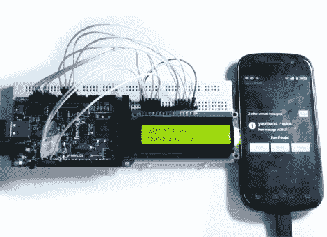

# 用于 Android 设备的字符 LCD 屏幕附件

> 原文：<https://hackaday.com/2011/07/12/character-lcd-screen-add-on-for-android-devices/>

这里有一个 [Android 配件项目，增加了一个辅助 LCD](http://www.elecfreaks.com/1158.html) 显示屏。它利用 Android 开放附件开发套件标准将 16×2 字符 LCD 作为 USB 设备进行连接。它将手机上的一个应用程序与你在左侧看到的基于 ATmega2560 的 Arduino 兼容板的固件配对，该应用程序透明地运行。该应用程序在辅助硬件连接后立即启动，并负责确定将哪些文本行推送到 LCD 上。示例代码在最上面一行显示当前时间，并在收到新的文本消息时滚动它们。

这是一个让你接触 ADK 硬件的好方法。我们已经看到它被用于更大的显示器[，像这个 LED 字幕](http://hackaday.com/2011/05/16/google-adk-project-shows-just-how-easy-it-is-to-use/)，但是这个更小的测试项目不需要太多的硬件设置。你可能手头已经有一个 Arduino 和字符 LCD，或者可以很容易地借用，这使得这成为一个简单的周末项目。

Arduino 兼容板上一个注释；它被称为 Freakduino ADK，但我们无法确定它是否是怪胎实验室的产品。如果你对此有什么见解，请留下评论。