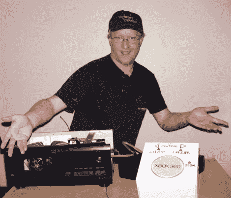

# Xbox 360 DVD 换碟机是游戏懒惰的终极

> 原文：<https://hackaday.com/2011/07/12/xbox-360-dvd-changer-is-the-ultimate-in-gaming-laziness/>

让我们面对现实吧——游戏玩家是出了名的懒惰。在他的网络系列的最新一集中，【Ben Heck】扮演了一个典型的游戏玩家角色，并将懒惰因素提高到 11，感叹他需要从沙发上起来交换他的 Xbox 360 游戏机上的光盘。他从不允许懒惰妨碍他的黑客生涯，他开始行动，为了建造一个 Xbox DVD 换碟机系统，他去了他的商店。

他抓起一对 CD 换碟机，打开看看它们是如何操作的。在根据 CD 装载方法选择了最佳候选后，他开始拆卸换碟机。旧的 CD 播放器和它的内脏被移走了，他用从他的 Xbox 上拆下来的 DVD 驱动器部件替换了它。更换组件需要相当多的修整和调整，但看起来[Ben]做得很好。

项目的机械部分完成后，他开始钻研电子学。CD 换碟机不知道如何与 Xbox 接口，反之亦然，所以[Ben]必须设计一种方法让两个设备进行通信。他使用 Arduino Uno 来控制系统，只有当 Xbox 认为它的驱动器插槽打开时，才会触发 CD 转盘。

虽然系统看起来有点粗糙，控制器相当笨重，但我们喜欢这个东西！不管你懒不懒，把这两个设备塞在一起就是黑客的全部。