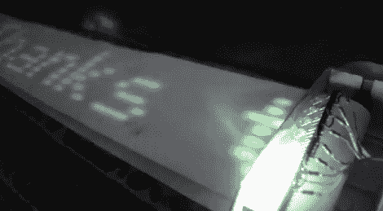

# 使用磷光的人造 LED 滚动条

> 原文：<https://hackaday.com/2011/07/13/faux-led-scroller-using-phosphorescence/>

Hackaday 的读者[BGR]写了一篇分享他制作的一个很酷的“穷人的 LED 滚动条”的视频。他决定在移动显示器上只使用少量的发光二极管，而不是建立一个巨大的发光二极管阵列，花费大量的时间布线和编程。

scroller 是基于 PIC16F887 微控制器构建的，该微控制器驻留在他为该项目借来的 EasyPIC6 开发板上。PIC 控制八个明亮的白色发光二极管，用于在许多印刷供应设备中可以找到的长条状磷光纸上书写文本。这张纸的分发装置是由几个来源的零件拼凑而成的，包括一台激光打印机和录像机。

当他想要显示消息时，他将文本输入到他编写的 flash 应用程序中。该应用程序通过一个单独的串行代理将 LED 字节值发送到他的滚动器，该代理通过他计算机的 COM 端口与 pic 通信。

这种效果非常光滑，看起来类似于缓慢移动的扩散 LED 滚动条。大约 5 分钟后，在一个漆黑的房间里，消息消失了，这是完美的，因为他原本打算用这个设备来显示 Twitter 的更新。他已经在考虑对这个项目进行第二次修改，他想把它挂在墙上——听起来很棒！

一定要在 YouTube 旁边看视频，或者在这里继续阅读观看。

[https://www.youtube.com/embed/9X_q6Db53jQ?version=3&rel=1&showsearch=0&showinfo=1&iv_load_policy=1&fs=1&hl=en-US&autohide=2&wmode=transparent](https://www.youtube.com/embed/9X_q6Db53jQ?version=3&rel=1&showsearch=0&showinfo=1&iv_load_policy=1&fs=1&hl=en-US&autohide=2&wmode=transparent)