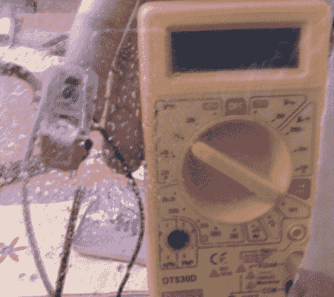

# DIY 雨刷速度控制和防撞

> 原文：<https://hackaday.com/2011/07/13/diy-wiper-speed-control-and-collision-avoidance/>

在许多新车上，自动雨刷速度控制可以作为升级，尽管大多数汽车根本不提供前端碰撞预防。新德里 Guru Tegh Bahadur 理工学院的学生[Rishi Hora]和[Diwakar Labh]，[开发了他们自己版本的这些功能](http://uniti.img/stories/uniti/news_letters/2011/april-newsletter%20low%20res.pdf)，(PDF 警告，跳到第 20 页)，他们参加了去年的德州仪器模拟设计竞赛。在[Gurmeet Singh]和[Pawan Kumar]教授的指导下，这两人使用容易获得的部件构建了该系统，其中当然包括 TI 的 MSP430 微控制器。

防撞系统使用一个激光发射器和一个光学探测器来估计你的汽车和你前面的车辆之间的距离，如果你靠得太近，就会发出警报。与此有些类似，刮水器速度控制系统使用一对红外发射器和检测器来估计挡风玻璃上积聚的水量，并在必要时触发刮水器。

虽然不是开创性的，但该系统在印度的雨季会非常方便，并且似乎很容易安装在一辆旧车上。我们唯一不确定的是用激光瞄准车流中的汽车，但是有相当多的替代方法可以用来测量距离。

继续阅读，观看两个系统的视频演示。

[https://www.youtube.com/embed/euVh5xtFs1M?version=3&rel=1&showsearch=0&showinfo=1&iv_load_policy=1&fs=1&hl=en-US&autohide=2&wmode=transparent](https://www.youtube.com/embed/euVh5xtFs1M?version=3&rel=1&showsearch=0&showinfo=1&iv_load_policy=1&fs=1&hl=en-US&autohide=2&wmode=transparent)