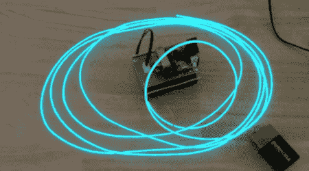

# 变色 EL 线

> 原文：<https://hackaday.com/2011/07/13/color-changing-el-wire/>

所有 EL 线驱动器都使用谐振电路向 EL 线供电。这是一个高效的系统，但[Paul]注意到，当从同一个驱动器上断开不同长度的电线时，颜色会发生一些变化。他意识到这是因为谐振电路的频率在变化，所以【保罗】唯一合理的做法就是搭建一个[颜色褪色的 EL 线驱动器](http://www.dorkbotpdx.org/blog/paul/el_wire_color)。

用于驱动导线的电路非常简单。[Paul]用一块小板子来切换两个晶体管，产生交流电流。这是通过一个升压变压器发送的，为 EL 线供电。有必要使用 aqua 或'创蓝' EL 线，因为这是透明的线外套。许多颜色的 EL 电线都有一个荧光护套——很像荧光灯泡——可以将电线内部产生的颜色改变为不同的颜色。[保罗]说颜色的变化是微妙的，但独特的。

当然，没有变色 EL 线的视频，构建就什么都不是。休息之后来看看。

[https://www.youtube.com/embed/gROEIlym6Dw?version=3&rel=1&showsearch=0&showinfo=1&iv_load_policy=1&fs=1&hl=en-US&autohide=2&wmode=transparent](https://www.youtube.com/embed/gROEIlym6Dw?version=3&rel=1&showsearch=0&showinfo=1&iv_load_policy=1&fs=1&hl=en-US&autohide=2&wmode=transparent)