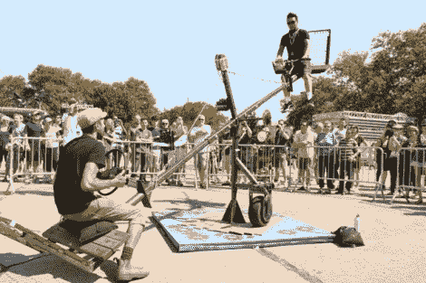

# 红牛创作大赛结果

> 原文：<https://hackaday.com/2011/07/14/red-bull-creation-contest-results/>

72 小时的黑客攻击随着红牛的诞生而达到高潮。今年的挑战是从垃圾中造出能驱动人的东西。很难将该活动的所有方面都集中在一个地方，因此如果您无法参加，您可以查看以下链接。

Tech Crunch 对所有获奖者进行了概述。上面是我们最喜欢的照片之一。旋转跷跷板不是一般的游乐场玩具。它内置的加速度计会等待力达到峰值，然后拍下照片供以后欣赏。[旧金山黑客空间 Techshop](http://techshop.ws/) 获得了团队奖。休息之后不要错过视频

总冠军是来自明尼阿波利斯的一个名为 1.21 Jigawatts 的团队。他们制作了一个人类大小的仓鼠轮子，轮子后面拖着一个小跟随者。当你走路时，跟随者会在人行道上打印收到的短信，有点像粉笔机器人。我们四处寻找它的视频，我们能找到的最好的是[这个](http://www.youtube.com/watch?v=YZhsCd5V878)。

[https://www.youtube.com/embed/T_cERJsDn3U?version=3&rel=1&showsearch=0&showinfo=1&iv_load_policy=1&fs=1&hl=en-US&autohide=2&wmode=transparent](https://www.youtube.com/embed/T_cERJsDn3U?version=3&rel=1&showsearch=0&showinfo=1&iv_load_policy=1&fs=1&hl=en-US&autohide=2&wmode=transparent)

[谢谢 NeonDion]