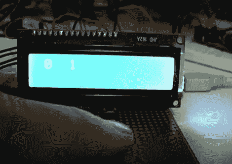

# 建造一个单键密码锁

> 原文：<https://hackaday.com/2011/07/14/building-a-single-button-combination-lock/>

小鸟电子公司的约翰·鲍克夏尔正在考虑密码锁，以及如何改进或者至少改变这些锁的工作方式。传统的组合锁可以通过多种方式实现，其中大多数我们都很熟悉。标准的旋转挂锁和基于键盘的电子保险箱工作得很好，但他有兴趣看看如何实现一个单键密码锁。

[John]认为建造这种锁最好的方法(如果不是唯一的方法)是测量按钮按压间隔。在他的例子中，他决定改为监控他的按钮按压之间的间隔，但是概念是相同的。他首先测试自己，看看他能多准确地按下和释放按钮，在两次按下之间留出一秒钟的间隔。在查看结果后，他决定需要在代码中加入至少 10%的误差余量，以补偿人为误差。

然后，他创作了一个 Arduino 草图来测试他的想法，定义了一组按键间隔，可以用来“解锁”他想象中的金库。它工作得很好，正如你在下面的视频演示中看到的。

现在我们并不建议你用这种类型的锁锁住你的薄荷状态我的小马收藏或你的非法武器藏匿处，但它可能是有用的，作为某些项目/小工具的额外故障保险，你想把所有都留给自己。

 <https://www.youtube.com/embed/eRtMYWTwv5c?version=3&rel=1&showsearch=0&showinfo=1&iv_load_policy=1&fs=1&hl=en-US&autohide=2&wmode=transparent>

 </body> </html>