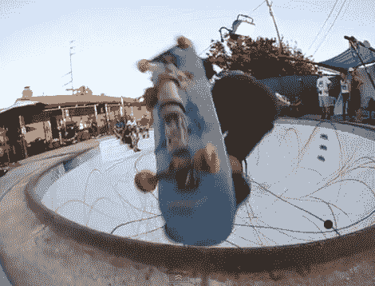

# 滑板标签

> 原文：<https://hackaday.com/2011/07/16/skateboard-tagging/>

我们憎恶破坏行为，但我们热爱艺术。这里有一个滑板黑客，让年轻和年老的滑板朋克们在骑行时标记他们的地盘。在伦敦长大的[多媒体街头艺术家](http://en.wikipedia.org/wiki/D*Face)【D * Face】在他的滑板底部添加了一个安装系统，其中包括一罐喷漆。我们有点惊讶，有足够的空间，但该系统非常适合。他们没有被锁定在一个恒定的流中，因为该系统让骑手(或旁观者)通过远程控制启动喷雾罐。

但是画笔只是画家工具链中的一部分。为了获得最有趣的效果，一个游泳池被漆成白色作为画布，一群滑冰者被释放到上面，尝试修改后的木板。休息后看看视频，看看由此产生的多彩而令人愉悦的曲线。我们只希望没有人在保释的同时弄脏画布。

[https://www.youtube.com/embed/ScW5kWzSaSI?version=3&rel=1&showsearch=0&showinfo=1&iv_load_policy=1&fs=1&hl=en-US&autohide=2&wmode=transparent](https://www.youtube.com/embed/ScW5kWzSaSI?version=3&rel=1&showsearch=0&showinfo=1&iv_load_policy=1&fs=1&hl=en-US&autohide=2&wmode=transparent)

[谢谢杰罗姆]