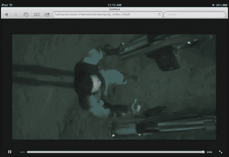

# 在 IPad 上播放 DVD

> 原文：<https://hackaday.com/2011/07/16/playing-dvds-on-an-ipad/>

哈里森·杰克逊想出了如何给 iPad 增加 DVD 播放功能。它不需要越狱，也不需要对你珍贵的平板电脑进行任何硬件修改。这项工作通过一些服务器端处理完成，并通过浏览器回放。

流行的开源多媒体播放器 VLC 能够在播放时从命令行编码。[Harry 的] [option flag 精通程序](http://www.doityourselfharry.com/sandbox/vlcCommandLine.txt)允许他将 DVD 转换成 iPad 友好的 320×240 格式。但仅此并不能让视频更接近视频设备。你需要运行一个可以传输视频的网络服务器。这个例子是关于 OSX 的，但是因为他使用的是 Apache 服务器，所以在任何 Unix 变种上复制应该很简单。一旦你启用了 Apache mime 类型的 m3u8 文件，iPad 浏览器就可以指向 VLC 发出的文件地址，你马上就可以看电影了。

我们想用一台运行 XBMC 的 ATV 2 取代我们的家庭影院前端，但想到客厅里没有光驱，我们需要深思熟虑。如果这成为一个可行的选择(这不是从 DVD 质量降级)，这将是一个显而易见的跳跃。

休息之后不要错过演示视频。完整的说明在那个片段的评论部分。

 <https://www.youtube.com/embed/MZcjIZsl0gA?version=3&rel=1&showsearch=0&showinfo=1&iv_load_policy=1&fs=1&hl=en-US&autohide=2&wmode=transparent>

 </body> </html>