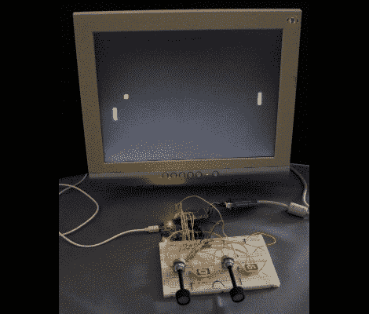

# 芯片套件上的 VGA Pong

> 原文：<https://hackaday.com/2011/07/16/vga-pong-on-a-chipkit/>

[Nathan]得到了一个 chipKIT Uno32 开发板，并写了一个可以用 VGA 显示器播放的 Pong 草图。我们喜欢让它看起来非常经典的硬件。它使用一组基于电阻的数模转换器来产生 VGA 协议的彩色信号。每个玩家的分数显示在 7 段显示屏上，而不是打印在屏幕上。拨片由一对电位计组成。

你会记得[chip kit uno 32 是一款 Arudino 兼容的 32 位开发板](http://hackaday.com/2011/05/27/chipkit-uno32-first-impressions-and-benchmarks/)。这个项目展示了硬件如何处理，如果你知道你在做什么，用它产生 VGA 信号是多么容易。

对于那些对游戏物理感兴趣的人来说，[Nathan]在他的帖子底部提供了一个关于球运动的很好的解释。如果您需要更多的细节，可以阅读他所链接的代码包。