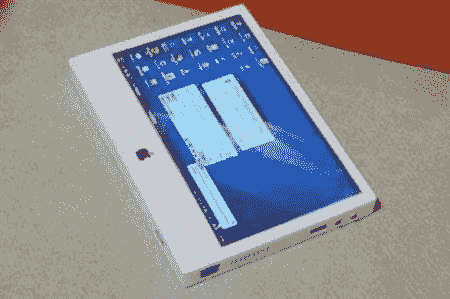

# 不买 IPAD，自己做一个！

> 原文：<https://hackaday.com/2011/07/17/dont-buy-an-ipad-make-one/>

当刘决定买一台新的 iPads 时，他决定自己开发一台平板电脑。他的作品就像你所期待的任何平板电脑一样，具有一些不错的额外功能，例如为任何微软爱好者在 Windows XP 上运行。[Lui 的]平板电脑显然只花了他大约 300 美元，大约是真品价格的一半。两部分的视频以快进的方式展示了整个施工过程，包括最终工作产品的演示。看起来这款平板电脑是用备用的平板电脑/笔记本电脑组件制成的，外壳是由铝板制成的，然后被涂上油漆并贴上苹果贴纸。最终产品比真的要厚一点，但在[Lui]设计的笔记本电脑外壳中看起来很棒。值得称赞的是，这个家伙节省了一些钱，并在这个过程中做出了一些伟大的事情，休息后的视频绝对值得一看。这不是我们第一次看到这种事情，实际上我们已经在[见过一些](http://hackaday.com/2008/07/14/mac-tablets-made-by-fans/)。

 <https://www.youtube.com/embed/I6TAguL2nFU?version=3&rel=1&showsearch=0&showinfo=1&iv_load_policy=1&fs=1&hl=en-US&autohide=2&wmode=transparent>

 </body> </html>