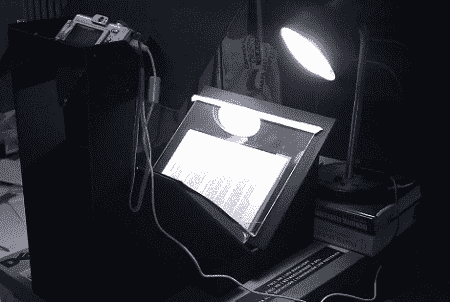

# DIY 图书扫描仪每小时处理 600 页

> 原文：<https://hackaday.com/2011/07/18/diy-book-scanner-processes-600-pageshour/>

像任何有学问的人一样，[贾斯汀]有一大堆书。由于没有束缚于纸质书的死树格式，而且电子阅读器随处可见，他决定建造一个低成本的图书扫描仪，这样整个图书馆都可以放在他的口袋里。如果这还不够，还有一个补充的[图书图像处理器](http://www.314pies.com/projects/diy-book-scanner/item/17/)来将各个图片组合成一个分页的大部头。

构建非常简单——只需要一点黑色的工艺板作为相机支架和可调节的书籍支架。[Justin]最后用 CHDK 软件黑进了一个遥控触发器。这台扫描仪每小时可以拍摄 600 页，尽管如果他升级到双摄像头设置，这一数字还会大幅增加。

我们想知道 OCR 是否可以应用于这个版本——在你的计算机上有一个页面的图像是很好的，但可搜索的文本将是惊人的。如果你有大量 OCR 工作的经历或故事，一定要在评论中留下注释。查看下面的视频，了解构建过程和操作演示。

 <https://www.youtube.com/embed/Z-wJs3Xg4Y4?version=3&rel=1&showsearch=0&showinfo=1&iv_load_policy=1&fs=1&hl=en-US&autohide=2&wmode=transparent>

 <iframe class="youtube-player" width="800" height="480" src="https://www.youtube.com/embed/6C_yJ7eMs24?version=3&amp;rel=1&amp;showsearch=0&amp;showinfo=1&amp;iv_load_policy=1&amp;fs=1&amp;hl=en-US&amp;autohide=2&amp;wmode=transparent" allowfullscreen="true" style="border:0;" sandbox="allow-scripts allow-same-origin allow-popups allow-presentation"/> </body> </html>