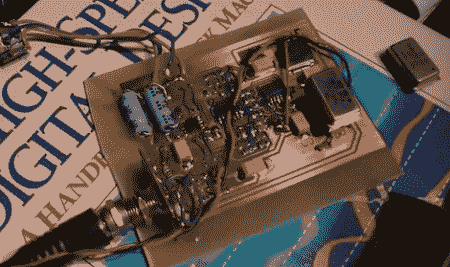

# [Jeri Ellsworth]构建了一个软件无线电

> 原文：<https://hackaday.com/2011/07/19/jeri-ellsworth-builds-a-software-radio/>

[Jeri Ellsworth]一直致力于使用 FPGA 作为振荡器和 PC 声卡 DSP 的直接变频接收机。作为一名优秀的主持人，她首先讲述了[无线电接收的历史和理论](http://www.element14.com/community/groups/jeri-ellsworth?ICID=hp_jerivideo_july8)(快进到 1:30)，然后深入探讨了[的结构](http://www.youtube.com/watch?v=YFVgq3ZB0Mo)(零件 [2](http://www.youtube.com/watch?v=nTj_KvBuRmg) 和 [3](http://www.youtube.com/watch?v=xVNgGJ7kcYs) 也可用)。

与“老派”接收机不同，软件无线电的功能可以通过修改程序来改变。制造一个这样的接收器并不需要很多部件，但是无线电背后的数学和编程可能会非常复杂。一切都被输入现成的 PC 声卡进行处理。Jeri 使用的 16 位声卡覆盖了 22 千赫的无线电带宽，但使用 24 位声卡可以将带宽提高到 48 千赫。

建筑本身只是天线之间的一个小电路，但我们必须尊重[Jeri]处理大量模拟疯狂的能力。在软件设计的电台上还有一个很棒的 PDF，Jeri 链接到非 youtube 格式的解释一切。考虑到我们在过去的一个世纪里已经走过了[相当长的一段路](http://hackaday.com/wp-content/uploads/2011/07/pencilcrystal.jpg)，这个接收器是相当令人印象深刻的。