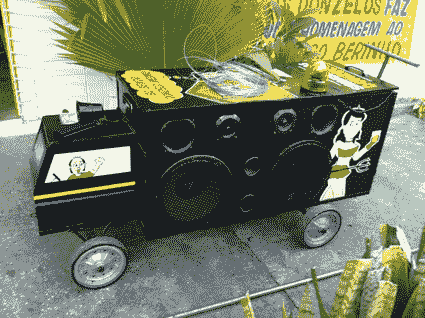

# gambiologia–巴西物理项目黑客

> 原文：<https://hackaday.com/2011/07/19/gambiologia-brazilian-physical-item-hacking/>

根据[源文章](http://www.we-make-money-not-art.com/archives/2011/07/gambiologia.php)，Gambiologia 是“Gambiarra 的科学”对于那些不是来自巴西的人来说，Gambiarra 是“一种以低成本和大量自发性的替代方式创造性地解决问题的巴西文化实践。”换句话说，就是对真实世界物品的黑客攻击。Gambiarra 还与回收利用有关，因为它不是扔掉用过的东西，而是变成其他新的东西。

虽然黑客可能不被认为是传统意义上的艺术，但[【Fred Paulino】](http://www.we-make-money-not-art.com/archives/2011/07/gambiologia.php)旨在通过他的 20 位巴西和国际艺术家的展览来改变这一点。作为一名“赌博专家”，他收集了相当多的黑客和 mod 供世人欣赏。从显示眼睛的电脑显示器，到一个开着的 2 乘 4 的马桶，他的展览似乎涵盖了广泛的物理黑客，或称 Gambiarra。

一定要看看[文章](http://www.we-make-money-not-art.com/archives/2011/07/gambiologia.php)，因为许多黑客相当聪明或不寻常(即使有些看起来有点不安全)。想了解更多将物品改造成新东西的例子，看看这个由卷笔刀制成的[钻](http://hackaday.com/2011/06/05/how-to-make-a-hand-drill-out-of-a-pencil-sharpener/)或这个使用空气清新剂部件的遥控器[相机触发器](http://hackaday.com/2011/02/04/remote-camera-trigger-built-from-air-freshener-parts/)。