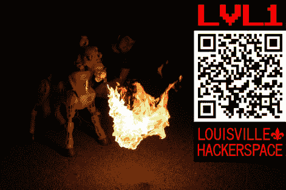

# Hack A Day 访问路易斯维尔的 LVL1 Hackerspace

> 原文：<https://hackaday.com/2011/07/22/hack-a-day-visits-lvl1-hackerspace-in-louisville/>

我们最近有幸参观了肯塔基州路易斯维尔的 LVL1 黑客空间。路易斯维尔地区的任何还没有访问过的黑客正在给自己造成很大的伤害。该空间最近在 7 月迎来了一周年纪念日，但这很难说。这个空间有许多你只会在旧空间期待的东西，比如激光切割机(我们参观时添加的)、数控机床、大量的电子工作台，甚至还有一个为音乐爱好者准备的区域。LVL1 黑客空间最好的部分是它的成员。我们都听说过黑客空间的恐怖故事，有戏剧性的情节或过于严格的规则，但 LVL1 的人非常友好，愿意提供帮助。

微型上校(总统，如果你想走那条路)，[克里斯托弗·Cprek]，给了我们一个空间和它目前的项目之旅。其中最令人印象深刻的是白星气球项目，该项目旨在驾驶气球飞越大西洋。还有[路易斯维尔录音师](http://wiki.lvl1.org/Louisville_Soundbuilders)，他们每隔一周的周一晚上 8 点在这里聚会制作新乐器。其他一些项目包括一个[远程呈现机器人](http://www.lvl1.org/2011/06/30/hobo-the-roaming-bot/)、[一匹会喷火的小马](http://www.lvl1.org/2011/06/30/firepony-thats-right-pony-and-fire/)，以及一辆为底特律制造商设计的动力轮赛车。还有一些事情，比如肯塔基开源协会(KYOSS)在这个空间开会。甚至有几个机器人散布在周围。幸运的是，在我们拜访[ [布兰登·冈恩](http://www.engunneer.com/) ]的同时，他也在那里，他定期对他拜访的黑客空间进行视频参观；休息后观看他的太空之旅视频。

该空间通常在每周二 7:00 向公众开放，但请务必查看他们的[日历，了解更多](http://wiki.lvl1.org/Calendar)。如果你以前从未去过黑客空间，你一定要努力一下。创造空间的不是工具，而是人，LVL1 提供了这些。

[https://www.youtube.com/embed/7C8cKVqtUDY?version=3&rel=1&showsearch=0&showinfo=1&iv_load_policy=1&fs=1&hl=en-US&autohide=2&wmode=transparent](https://www.youtube.com/embed/7C8cKVqtUDY?version=3&rel=1&showsearch=0&showinfo=1&iv_load_policy=1&fs=1&hl=en-US&autohide=2&wmode=transparent)