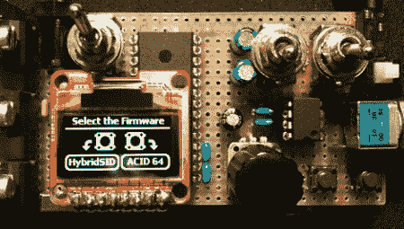

# 后续:便携式 SID 播放器现在是 PC 输出

> 原文：<https://hackaday.com/2011/07/20/followup-portable-sid-player-is-now-pc-output/>

当我们第一次报道[Markus]' [便携式 SID 播放器](http://hackaday.com/2011/06/03/portable-sid-plays-chiptunes/)时，我们开始梦想一个大约在 1987 年的替代宇宙，其中包括一个叫做 Commodore ePod 的袖珍音乐播放器。[马库斯]' [更新的固件将他的 SID 播放器连接到一台电脑](http://dangerousprototypes.com/forum/viewtopic.php?f=56&t=2197&start=15#p24515)，我们想现在只能这样了。

新固件将便携式 SID 播放器作为独立设备或“网络 SID 设备”启动。便携式 SID 播放器现在可以作为 [Acid 64](http://www.acid64.com/) 或 [GoatTracker](http://sourceforge.net/projects/goattracker2/) 的输出设备。现在，[马库斯]SID 播放器拥有与[硬盘](http://www.hardsid.com/hardsid_uno.php)或被遗忘已久的[SID 卡](http://www.syntiac.com/sidcard.html)相同的功能集。

[Markus]可以播放 40，000 首 SID chip tunes，并且可以比他在原始版本中使用滚轮更容易地访问它们。新的固件是循环精确的，这意味着从这个 SID 播放器出来的声音将完全一样，就像在 C64 上播放一样。我们很想构建其中的一个([Markus]将整个项目开源)，但是为所需的 SID 去掉 C64 似乎是错误的。[不过，还有其他方法](http://www.swinkels.tvtom.pl/swinsid/)获取 SID。

查看下面的网络 SID 设备演示。

 <https://www.youtube.com/embed/mimSNZdvRj4?version=3&rel=1&showsearch=0&showinfo=1&iv_load_policy=1&fs=1&hl=en-US&autohide=2&wmode=transparent>

 </body> </html>