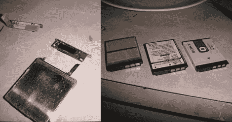

# 绕过制造商强加的电池锁定

> 原文：<https://hackaday.com/2011/07/21/bypassing-manufacturer-imposed-battery-lockouts/>

当[Barret]前几天去用他的相机时，它一直关机，在检查电池时，他发现它有点肿。知道他需要一个替代品后，[他求助于他闲置的一个售后电池](https://sites.google.com/site/barrettsthingsofinterest/home/announcements/secondpost)，但当他的索尼 Cybershot 相机不接受它时，他变得非常恼火。

显然，最近的固件更新导致他的相机拒绝非索尼电池，这种情况被他描述为“电池 DRM”。他不可能再向索尼支付 50 美元，而不是使用他已经拥有的 10 美元的完美电池，所以他决定自己纠正这个问题。

他剥去两个电池的塑料涂层，露出锂电池和充电电路。他把 PCB 从他的索尼电池上拆下来，稍加修整后移植到他的售后电池上。他用胶带把所有的东西都包起来，然后让他的弗兰肯电池转了一圈。这种方法非常有效，他非常满意，以至于在他那只老化的罗技(Logitech)鼠标上也进行了类似的更换。

随着越来越多的公司将竞争对手挡在用户可更换耗材市场之外，这种黑客攻击肯定会越来越普遍。