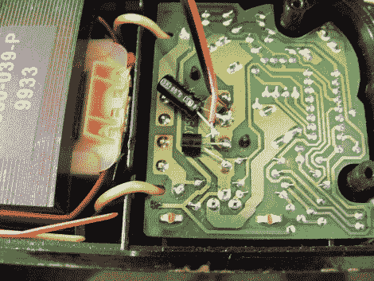

# 电动工具电池充电器修理

> 原文：<https://hackaday.com/2011/07/21/power-tool-battery-charger-repair/>

[Webby]从他父亲那里继承了一个无绳电钻，当他终于有时间使用它时，发现充电器在水中没电了。他拆开它，把问题缩小到充电器的主变压器，但不知道从那里去。一位朋友提出线圈的热保险丝可能已经熔断，经过进一步调查，[Webby]发现他的朋友是对的。

他取下保险丝，焊上一根电线进行测试——不出所料，充电器开始工作了。他拿起一个新的热保险丝来替换旧的，但他对修复还不太满意。如果保险丝已经烧断了一次，很难阻止它再次发生，所以他决定安装一个小型冷却风扇将是一个好主意。在切开一些通风孔后，他将风扇安装在外壳上，从充电器本身吸取电力。

虽然简单地在充电器上加一个风扇可能不是每个人心目中的完美解决方案，但[过去对[Webby]来说这已经很好了](http://elektrickery.blogspot.com/2011/07/toasty-modem.html),所以如果它没有坏…

[via [HackedGadgets](http://hackedgadgets.com/2011/07/20/drill-battery-charger-repair/)