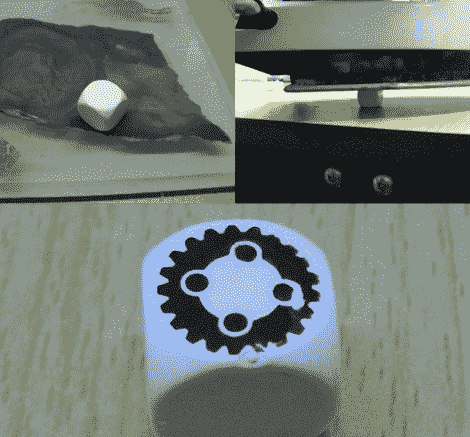

# 掷出你自己的墨粉转移骰子

> 原文：<https://hackaday.com/2011/07/22/roll-your-own-toner-transfer-dice/>

如果你碰巧在市场上购买一些设计师设计的骰子，或者需要为你创作的游戏定制一套骰子，你可以花一大笔钱来制作它们，[或者你可以自己做](http://www.dicecreator.com/2010/05/20/open-source-dice-making/)。

[Dicecreator]经营一个博客，致力于创作 DIY 游戏和收藏骰子的来龙去脉。这个主题不是我们通常会感兴趣的东西，但有一个特别的项目引起了我们的兴趣——DIY 墨粉转移骰子。非常类似于创建一个墨粉转移印刷电路板的过程中，他走过的步骤，使你自己的骰子几乎没有开销。

这些步骤对于那些在家里自己制作 PCB 的人来说可能非常熟悉。他从空白骰子开始，用越来越细的砂纸打磨骰子的边缘，直到它们为转移过程做好准备。图像被打印在光滑的喷墨照片纸上，然后用标准的熨斗将照片贴到每个模具上。在水中浸泡一会儿去除多余的纸张后，模具就可以使用了。

当然，这并不完全是火箭科学，但如果你试图替换丢失的骰子，或者如果你只是想为朋友制作一份有趣的礼物，这是一个很酷的小技巧。