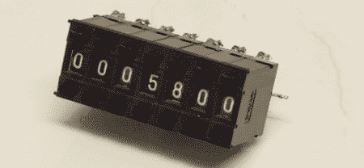

# 电阻替代盒

> 原文：<https://hackaday.com/2011/07/22/resistor-substitution-box/>

EEVblog 论坛上的[Vincent]有一个便宜的[电阻替代十进制盒](http://www.eevblog.com/forum/index.php?topic=4244.0)的想法。

该建筑使用他在易贝买便宜的十进制拇指轮开关。每个开关都与每个数字的电阻连接，并且每个开关都串联连接。结果是一个易于读取的小型电阻盒，电阻范围为 1ω至 10mω。

这不是一个新的想法；像这样使用编码器之前已经用一个 [BCD 电容替代盒](http://www.electricstuff.co.uk/capbox.html)完成过。我们看到一些关于[廉价可编程电流源](http://www.edn.com/article/470718-Programmable_current_source_requires_no_power_supply.php)(布局可用[此处](http://hackaday.com/wp-content/uploads/2011/07/bcd.png))的参考，它使用 BCD 开关和 LM317 调节器。虽然这种类型的建造已经存在了大约*年*，但是这些项目正在变得经济实惠，因为廉价的十进制或 BCD 开关可以从中国获得。

对于[Vincent]的项目，我们想知道预设 10ω盒子作为最低有效位是否更好。当然，这将意味着重新做项目，但它会增加最大阻力，并绕过最小数字的非常小的阻力。通常，我们称零欧姆电阻为“电线”，1-9 欧姆电阻为“更长的电线”如果你为 [E 系列](http://en.wikipedia.org/wiki/E_series#E_series)设计，你永远不会精确。