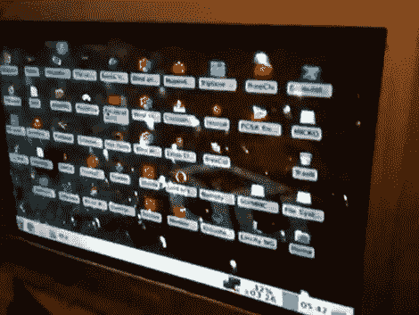

# 向开放的潘多拉添加视频

> 原文：<https://hackaday.com/2011/07/22/adding-video-out-to-the-open-pandora/>

很少有用户真正接触到开放的潘多拉主机。但是有经验的人可能会发现这种技术对于让电视运行起来很有用。这实际上一点也不难，但是如果你不想改变设备上的硬件，你首先必须找到一个适合 EXT 插孔的电缆插头。事实证明，这比实际需要的要困难得多，因为 TI 提供这种连接器，但只以 2200 的倍数出售。组织了一次团购，我们敢打赌你仍然可以参与其中。

有问题的连接器带有 TVout1 和 TVout2 导线。这些对应于 S-video 协议所需的亮度和色度信号。但是[MarkoeZ]想使用复合连接。事实证明这也不难，他将接地从插头连接到 RCA 插孔的接地，然后将两条视频线连接到中心导体，确保在色度侧添加一个内嵌 470pf 电容器。休息后，请查看嵌入的演示视频，以了解最终产品。

 <https://www.youtube.com/embed/XL7NzxVVjyM?version=3&rel=1&showsearch=0&showinfo=1&iv_load_policy=1&fs=1&hl=en-US&autohide=2&wmode=transparent>

 
[谢谢 RBZ]
 </body> </html>