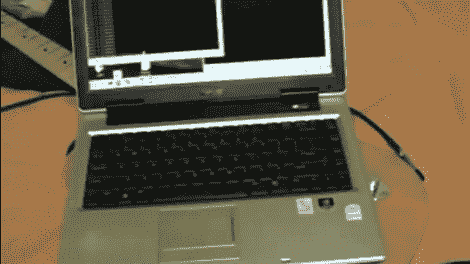

# 从 GPU 噪音中创造音乐

> 原文：<https://hackaday.com/2011/07/24/creating-music-from-gpu-noise/>

是的，这是一张笔记本电脑在电吉他上摇摆的照片。在一次只能被描述为真正奇怪的黑客攻击中，CNLohr 发现来自电脑的射频噪音可以通过吉他的拾音器播放音乐。

休息之后，看看这个片段，听听令人讨厌但非常清晰的《铃儿响叮当》。一旦[CNLohr]偶然发现图形处理单元的变化会影响拾音器检测到的音高，他就开始编写一些代码。现在他有了一个程序，可以自动计算窗口的大小，并在黑色背景上产生一个白色方块，以正确的频率拨入 GPU。

他在视频附带的注释中提到，他必须关闭 Vsync 才能正常工作。我们不知道为什么，但我们很想听听你的评论。

 <https://www.youtube.com/embed/aFexroOUG_g?version=3&rel=1&showsearch=0&showinfo=1&iv_load_policy=1&fs=1&hl=en-US&autohide=2&wmode=transparent>

 </body> </html>