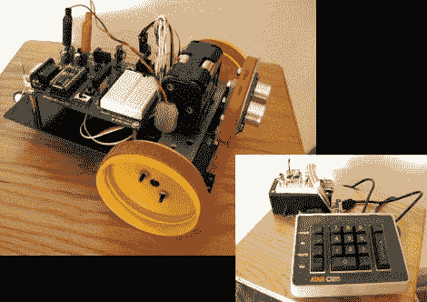

# Cypherbot 使用较旧的 UC 和复古控制器

> 原文：<https://hackaday.com/2011/07/23/cypherbot-uses-older-uc-and-retro-controller/>

[PJ·艾伦]一直在研究一个他称之为“密码机器人”的小机器人。控制电路非常熟悉；具有基本 Stamp 2 微控制器的教育板。这是一个更老、更慢的微处理器，但它在这个应用中工作得很好，因为它不需要速度或大量的数字运算。机器人的轮子由塑料盖(我们认为是花生酱罐)制成，带有橡皮筋用于牵引，每个橡皮筋都由伺服电机驱动。第三个轮子很小，可以根据需要旋转。

机器人的前面有一个安装在伺服电机上的 PING 超声波传感器，让机器人来回扫描，以获得更大的避障角度。除了自主模式，还有一个 Xbee 遥控器。[PJ]拿起一个雅达利键盘，用它作为用户输入。休息之后，看看视频中那个在房子周围开车的小家伙。

 <https://www.youtube.com/embed/U2HLGc8d95g?version=3&rel=1&showsearch=0&showinfo=1&iv_load_policy=1&fs=1&hl=en-US&autohide=2&wmode=transparent>

 </body> </html>