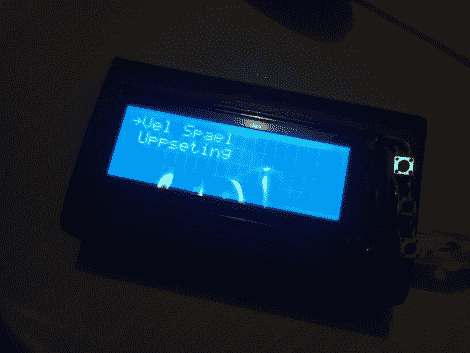

# 传递炸弹电子饮酒游戏

> 原文：<https://hackaday.com/2011/07/24/pass-the-bomb-electronic-drinking-game/>

[Ragnar]和他的朋友们厌倦了通常的周五晚上喝酒游戏。他们经历了掷骰子游戏、纸牌游戏和基于电视节目的游戏，然后[Ragnar]回到他的工作台，迅速找到一个电子解决方案，随机挑选一名玩家并分配一定数量的饮料。这是一个新奇的开始，但不是真正的游戏。在让项目搁置一段时间后，他重新审视它，并提出了一个更先进的解决方案。上面看到的盒子是他的第二次尝试；[一个叫传炸弹的游戏](http://havanissa.wordpress.com/2011/07/23/drinking-game-mk-2/)。

该案例是一个黑色铝制项目箱。用户界面包括一个 20×4 字符的 LCD 和三个按钮。休息后查看视频，了解菜单系统和英语翻译。一旦打开，你可以设置加速度计的灵敏度和选择游戏。目前,《传递炸弹》是唯一的选择——一个数字爆炸倒计时游戏。小心地把这个装置传给下一个玩家，不要弄乱加速度计，否则它会爆炸，你就只能喝酒了。

我们更喜欢[享受一杯美味的泡沫饮料](http://hackaday.com/2011/06/28/keep-all-eyes-on-your-kegerator-with-this-light-up-gauge-cluster/)而不是找理由再喝几杯，但无论如何都要让你开心。

 <https://www.youtube.com/embed/VLc6eIJgqz8?version=3&rel=1&showsearch=0&showinfo=1&iv_load_policy=1&fs=1&hl=en-US&autohide=2&wmode=transparent>

 </body> </html>