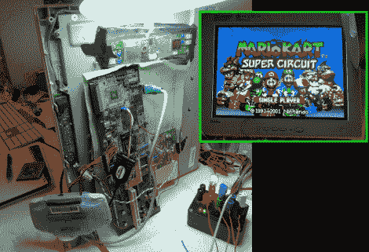

# Game Boy Advanced Video Out 大有可为

> 原文：<https://hackaday.com/2011/07/24/going-a-long-way-for-game-boy-advanced-video-out/>

这里有一个激烈的黑客攻击，让[马特埃文斯] [在一个更大的液晶显示器上玩游戏男孩高级](http://axio.ms/projects/iiyamameetxilinx/)。在这个过程的任何一步中，他都没有采取简单的方法。

他使用 FPGA 将来自 GBA 硬件的 LCD 信号转换为 1280×960 的图像，然后将其推送到大型显示器上。但是他用的是 FPGA 开发板吗？没有，相反，他在一家旧货商店买了一个旧 PCI 卡，因为它有 Xilinx Virtex-E FPGA。因此，他在那里要做的第一件事就是移除不需要的组件，并找出如何连接以重新编程芯片。

所以接下来你会抓住一个工作的显示器，并把它连接到 FPGA 信号，对不对？错了，[马特]有一个稍微有点破的显示器，去掉了 LVDS 部分，自己接线，并行传输 RGB 信号。

是啊，工作量很大。但正如你在休息后的剪辑中看到的，它像一个魔咒一样工作。如果你正在寻找其他一些粗糙的视频输出技巧，看看这个可以让你在示波器上玩游戏的工具。

[https://www.youtube.com/embed/MXrjUgqq6ik?version=3&rel=1&showsearch=0&showinfo=1&iv_load_policy=1&fs=1&hl=en-US&autohide=2&wmode=transparent](https://www.youtube.com/embed/MXrjUgqq6ik?version=3&rel=1&showsearch=0&showinfo=1&iv_load_policy=1&fs=1&hl=en-US&autohide=2&wmode=transparent)