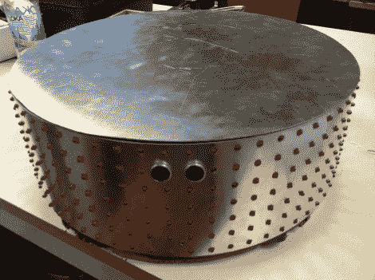

# 机器人吸尘器让清洁变成了游戏

> 原文：<https://hackaday.com/2011/07/25/robot-vacuum-makes-cleaning-into-a-game/>

这不是 Roomba hack，而是一个全新的真空吸尘器机器人构建。这是瑞典皇家理工学院六名学生的课堂项目成果。他们的论文中提供了大量信息，但公平的警告是，这是一个 8.6 MB 的 PDF 文件，我们无法让谷歌翻译。我们能够浏览 PDF 并剪切粘贴来翻译我们发现的有趣的部分。

不像 Roomba 只使用一个小扫地机来收集碎片，这个机器人实际上包括一个真空吸尘器。上图显示，圆柱体被 LED 矩阵包裹，正面有超声波传感器，用于避障。机器人使用 CAN 总线来控制内部的各种模块。我们认为没有任何自主功能，但这由遥控器来弥补。它通过 ZigBee 模块进行通信，包括 d-pad、触摸屏和加速度计。我们对游戏的玩法有点模糊，但至少有两个互动版本:一个叫球，另一个模仿经典游戏导弹指挥。

您可以[在他们的资源库中查看该项目的源代码](http://code.google.com/p/dustwars/)，或者在休息之后加入我们，观看两个演示视频。

 <https://www.youtube.com/embed/TrsCk6_gJcY?version=3&rel=1&showsearch=0&showinfo=1&iv_load_policy=1&fs=1&hl=en-US&autohide=2&wmode=transparent>

 <iframe class="youtube-player" width="800" height="480" src="https://www.youtube.com/embed/G4gP8wc6pdQ?version=3&amp;rel=1&amp;showsearch=0&amp;showinfo=1&amp;iv_load_policy=1&amp;fs=1&amp;hl=en-US&amp;autohide=2&amp;wmode=transparent" allowfullscreen="true" style="border:0;" sandbox="allow-scripts allow-same-origin allow-popups allow-presentation"/> </body> </html>