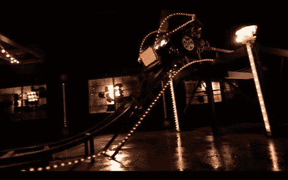

# 混合过山车概念

> 原文：<https://hackaday.com/2011/07/25/50089/>

丰田最近开展了一场宣传“好点子”的广告活动，演员们猜测丰田 Synergy Drive 混合动力系统在非汽车相关应用中的用途。一个被提出的想法是在游乐园使用汽车的再生制动系统，努力回收和利用一些过山车的动能。

丰田将一辆普锐斯 t [送到了 Deeplocal](http://www.deeplocal.com/projects/toyota-rollercoaster) 车队，车队的人对它进行了拆解，发现这辆车在刹车时可以产生 60 安培的电流。这不是一个微不足道的数字，所以他们决定创建一个很酷的演示来展示这项技术的强大。他们用普锐斯的内脏建造了一辆过山车，并将其放置在一个高架平台的顶部，该平台与一条 70 英尺长的轨道相连。在下面嵌入的视频中，他们将汽车从站台上推下轨道，使用再生制动系统照亮游乐园灯的大型显示器。

虽然这个视频只不过是一个精心制作的丰田广告，但我们不禁认为它非常酷。令人怀疑的是，我们很快就会突然看到基于混合动力的过山车涌入，但这个概念仍然很有趣。

[通过 [Notcot](http://www.notcot.com/archives/2011/05/2011-prius-rollercoaster.php)

<https://player.vimeo.com/video/22778905>

 </body> </html>