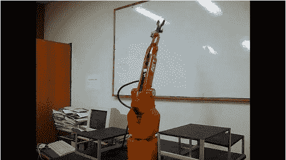

# 唱歌机器人

> 原文：<https://hackaday.com/2011/07/25/singing-robot/>

菲塞斯-UNSL(阿根廷圣路易斯国立大学工程学院)机电一体化实验室的 4 自由度 CXN-I 拟人机器人手臂是从零开始建造的，它仍然是一项关于机电一体化的教学和学习的工作，以便在未来建造另一个更强大和精确的手臂。当一名使用该设备的学生想到“嘿，这些马达噪音很大，不是吗？让我们把它们用在更有用的事情上”。

配备了一些吉他标签，一个机器人和一些嘈杂的伺服系统，[Guille]让机器人手臂唱了一首小歌，提高了几个八度，并将其包括在介绍视频中。因为，嘿，像那样挥动一个金属臂在机械上是相当费力的，而且对伺服系统也不是很好。

休息后加入我们的快速视频，歌唱在节目开始约 58 秒时开始。

 <https://www.youtube.com/embed/LQvWT_AYUX0?version=3&rel=1&showsearch=0&showinfo=1&iv_load_policy=1&fs=1&hl=en-US&autohide=2&wmode=transparent>

 </body> </html>