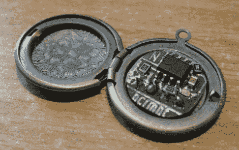

# 你吊坠盒里的是 Rom 吗？

> 原文：<https://hackaday.com/2011/07/25/is-that-a-rom-in-your-locket/>

[Andrew]最近订购了一些镶有 led 灯的吊坠，但随订单免费获得了一个小吊坠。没有一个真正的小吊坠的计划，它有点坐在那里，直到最后一些灵感击中。来认识一下 [ee-locket](http://necromant.ath.cx/wp/2011/07/25/ee-locket/) ，它包含一个带有 64k eeprom 的小型圆形 pcb、一些无源支持组件和背面的一个公引脚接头，这样您就可以快速将其插入您选择的 micro。

虽然这种东西的用途一开始可能并不明显，但坐下来写这篇文章时，我想到了一些应用，比如某种形式的钥匙和锁系统、不可能完成的任务梦想，或者只是在下一次求职面试中全力以赴。不管它是用来做什么的，这都是一个非常好的想法，我们只是喜欢人们把电子产品推到没人想到的地方。