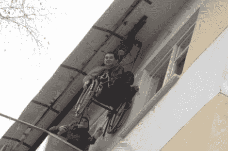

# 被忽视的残疾人自己造了该死的电梯

> 原文：<https://hackaday.com/2011/07/25/ignored-disabled-man-builds-his-own-damn-elevator/>

有一句老话是这样说的，“当事情变得艰难时，强者会建造他们自己的 5 层轮椅升降机。”

事实上，我们很确定这与俗话说的一点也不接近，但是当他的地方议会拒绝[Dmitry Bibi kow]让轮椅进入他公寓的请求时，[他确实做了](http://www.dailymail.co.uk/news/article-2017367/Disabled-Dmitry-Bibikow-builds-DIY-chairlift-waiting-SIX-years-council-install-lift.html?ito=feeds-newsxml)。

[Dmitry]是一名狂热的登山运动员，他在一次登山事故中受伤，导致双腿瘫痪。对他来说不幸的是，他和他的家人住在一栋没有残疾人通道的公寓楼的 5 楼。他没有搬出去，而是要求地方议会安装电梯，他们同意了。

随着时间的推移，随着项目在官僚主义的泥潭中越陷越深，[德米特里]开始对看到电梯安装失去希望。在依靠朋友帮助他进出公寓六年后，他自己动手，在阳台边上安装了一个升降椅。

根据[Dmitry]的说法，这种方法非常有效，他可以在比他更能干的邻居上楼之前从前门走到他的公寓。到目前为止，市议会还没有对电梯的事发表任何意见，他希望它保持原样。