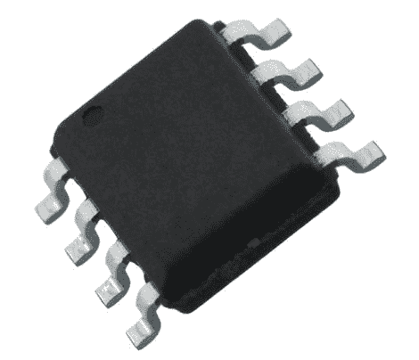

# AVR 节电技术的研究

> 原文：<https://hackaday.com/2011/07/26/a-study-in-avr-power-saving-techniques/>

[Scott]发现 Adafruit Industries 的 iCufflinks 非常有趣，但他认为声称的 24 小时运行时间有点短。他认为他可以至少提高产品的功耗一点点，以提高整体电池寿命。

根据他们的原理图，他订购了零件，并并排建造了两个相同的模型——一个运行他们的代码，另一个运行他的。他测量了基线电流，然后忙着精简袖扣的软件。他接触汇编已经有 20 年了，他从来没有为 AVR 写过汇编，但是从他的工作来看，他一点也不生疏。

他降低了 ATtiny 的时钟速度，并调整了其他一些设置，以节省 53μA，但真正的改进是通过一个相当简单的修复实现的。最初的代码要求处理器建立一个计数循环来休眠，他发现这非常浪费。相反，他选择将处理器置于空闲状态，使用芯片的看门狗定时器在该脉冲 LED 时唤醒它。仅这一变化就节省了 261μA 的功耗！

当他说到做到时，这些变化节省了大约 315μA 的电流，并且应该允许袖扣在不更换电池的情况下运行长达 38 小时。在[Scott]看来，对于一天的工作来说，电池寿命提高近 60%是相当不错的，我们倾向于同意这一点。