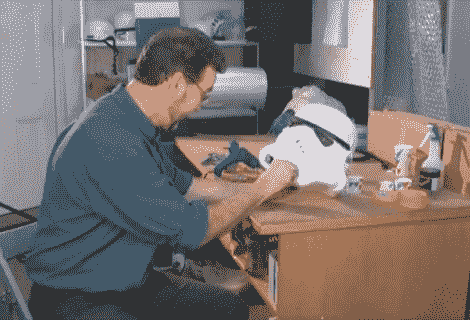

# 制作和销售星球大战服装被裁定为合法

> 原文：<https://hackaday.com/2011/07/28/making-and-selling-star-wars-costumes-ruled-to-be-legal/>

几年来，安德鲁·安斯沃思一直在制作和销售基于《星球大战》角色的服装(有些是原创，有些是他自己创作的)。卢卡斯影业在 2004 年起诉他侵犯知识产权，索赔 2000 万美元。他停止了在美国销售这些服装(因为这是美国的版权)，但现在英国最高法院做出了对他有利的裁决，支持他的主张，即这些服装是功能性物品，而不是艺术品。

对他来说很好，但版权问题不是我们感兴趣的。BBC 展示他使用真空成型机制作冲锋队头盔的片段真正引起了我们的注意。进一步的搜索让我们找到了休息后的 13 分钟视频，展示了整个过程，从手工雕刻模具，到形成组件，以及上面看到的最终组装。这是一个令人着迷的过程，让我们想要建造自己的真空成型器(最好是比这个规模更大的[)。无论是《星球大战》、](http://hackaday.com/2010/12/02/vacuum-forming-at-home/)[、](http://hackaday.com/2009/10/13/daft-punk-replica-helmet/)还是你想到的任何其他项目，它都会派上用场。

 <https://www.youtube.com/embed/Qk_048JvrXc?version=3&rel=1&showsearch=0&showinfo=1&iv_load_policy=1&fs=1&hl=en-US&autohide=2&wmode=transparent>

 
[谢谢丹尼]
 </body> </html>