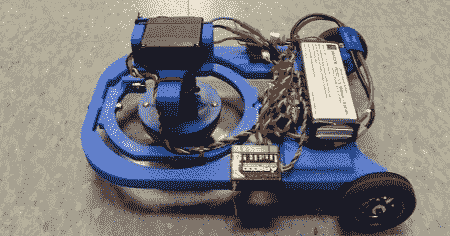

# 3D 打印奇点驱动平台

> 原文：<https://hackaday.com/2011/07/28/3d-printed-singularity-drive-platform/>

【塞拉斯】是奥林学院的学生，在业余时间用[奇点驱动系统](http://exhibit13.weebly.com/single-omnidrive-platform.html)想出了一个平台。

本月早些时候，我们报道了一个奇点驱动的乐高模型。这个驱动系统不是轮子、踏板或腿，而是一个沿垂直轴旋转的半球。有趣的是，机器人根本不改变其驱动电机的速度或方向。 [IEEE](http://spectrum.ieee.org/automaton/robotics/diy/youve-never-seen-a-drive-system-like-this-before) 现在称这个驱动系统为“奇点驱动”，因为*数学*。

让[塞拉斯]建造得非常漂亮的是，整个平台是用 3D 打印机制造的。不像以前的奇点平台，我们希望他把他的设计放到网上；受猕猴桃机器人启发的三信号驱动平台将会非常酷。不像你能乘坐的那辆[那么令人敬畏，但仍然很酷。](http://hackaday.com/wp-content/uploads/2011/07/cover.jpg)

查看下面的视频，了解[Silas]的构建演示。

 <https://www.youtube.com/embed/nIEBChw5x8Q?version=3&rel=1&showsearch=0&showinfo=1&iv_load_policy=1&fs=1&hl=en-US&autohide=2&wmode=transparent>

 </body> </html>