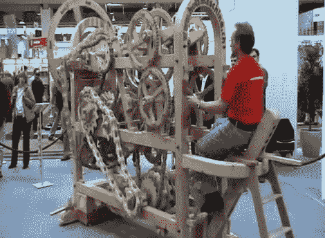

# 木制机器属于威利·旺卡的工厂

> 原文：<https://hackaday.com/2011/07/28/wooden-machine-belongs-in-willy-wonkas-factory/>

看那台木制的机器 ( [翻译](http://translate.google.com/translate?js=n&prev=_t&hl=en&ie=UTF-8&layout=2&eotf=1&sl=auto&tl=en&u=http%3A%2F%2Fholzmaschine.ch%2Fmaschine%2Fraederwerk%2Findex.html))是用来……它确实是……它被建造是因为……好吧，在这种情况下，问它做什么或者为什么要建造它是个错误的问题。[Erich Schatt]早在 1995 年就开始制作他称之为“轮子”的作品。它仅用了七年时间就完成了，并且全部由木头制成。休息后的视频显示了大量的移动部件。

链条是仿照自行车链条设计的，自行车链条用于将“骑手”的运动传递到整个机器。每个部分的传动装置都经过精心计算，然后通过反复试验加以完善。这种复杂性甚至需要差速器和万向节。它看起来令人着迷，因此它在会议上出现，并在艺术展览中展出。

还值得一提的是，这来自一个看起来非常简陋的商店。[Erich]贴了一些他工作室的照片，除了大量的酒吧夹具，这只是普通的车库或地下室设置。

 <https://www.youtube.com/embed/k5wJCzksT9k?version=3&rel=1&showsearch=0&showinfo=1&iv_load_policy=1&fs=1&hl=en-US&autohide=2&wmode=transparent>

 
[谢谢米楚]
 </body> </html>