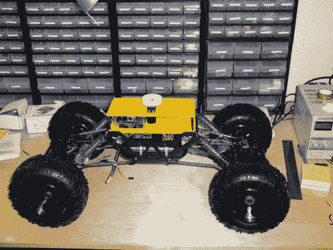

# 遥控汽车和猎兔犬板配对，打造多功能机器人

> 原文：<https://hackaday.com/2011/07/28/rc-car-and-beagle-board-mate-for-a-versatile-robot-build/>

这是一个有足够动力的火星车项目。这不仅体现在它的移动能力上，也体现在它的处理能力上。

这里使用的遥控车 ( [翻译](http://translate.google.com/translate?js=n&prev=_t&hl=en&ie=UTF-8&layout=2&eotf=1&sl=auto&tl=en&u=http%3A%2F%2Fwebdelcire.com%2Fwordpress%2Farchives%2F974))并不过分昂贵，但提供了很多功能。它通过两个伺服电机进行前后转向，以及每端的独立驱动电机。该框架还提供了一个先进的悬挂系统，让车辆弯曲，以保持尽可能多的车轮在地面上。如果你不想让你的项目陷入硬件设计的话，这是一个很好的发现。

在事情的控制方面，选择了一个比格犬板。休息后的演示显示它控制一个附加的炮塔伺服系统，以及通过键盘控制的驱动机制。这些都是通过运行在主板上的嵌入式 Ubuntu 映像驱动的。这应该提供足够的处理能力，以便在未来的版本中添加避障和自主例程。

 <https://www.youtube.com/embed/cTUvEsW8RbQ?version=3&rel=1&showsearch=0&showinfo=1&iv_load_policy=1&fs=1&hl=en-US&autohide=2&wmode=transparent>

 
[谢谢卡洛斯]
 </body> </html>