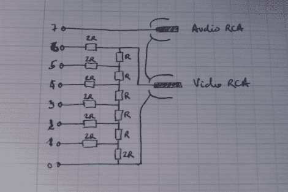

# NTSC 视频和凤蝶视频一起输出

> 原文：<https://hackaday.com/2011/07/28/ntsc-video-out-with-the-papilio-one/>

[Ben Leperchey]正在使用 Papilio One FPGA 板构建一个世嘉主系统克隆，尽管他的最终目标尚未实现，但他同时也带来了一些很棒的东西。

自然，任何游戏系统克隆都需要 NTSC/PAL 视频输出。由于没有人建造过电视输出“翅膀”(Papilio One 版本的盾牌或分线板)，[Ben]自己去做了。仅使用 14 个电阻和一个低通音频滤波器，他就可以相对轻松地获得他想要的视频输出。他在凤蝶上运行的 VHDL 代码完成了创建视频信号的所有艰苦工作，而他设计的机翼主要处理连接。

这是我们看到的第一批来自凤蝶阵营的项目/组件之一，看起来事情有了一个好的开始。一旦主系统完成，我们迫不及待地想看到它的实现！

继续阅读，观看 Papilio One 和[Ben 的]电视输出翼的快速视频演示。

 <https://www.youtube.com/embed/f9I8JYqx2YY?version=3&rel=1&showsearch=0&showinfo=1&iv_load_policy=1&fs=1&hl=en-US&autohide=2&wmode=transparent>

 </body> </html>