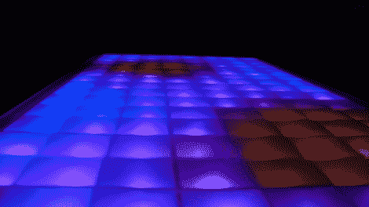

# RGB LED 光谱分析仪茶几

> 原文：<https://hackaday.com/2011/07/29/rgb-led-spectrum-analyzer-coffee-table/>

今年，作为合作项目的一部分，为德州仪器工作的学生被要求围绕该公司的 MSP430 微控制器构建一个项目。一个由三名学生组成的团队，[Max Thrun，Mark Labbato，Ian Cathey]决定建造一个可以完美适合任何大学生宿舍的东西—[一个 RGB LED 咖啡桌](http://e2e.ti.com/group/msp430launchpad/m/project/447779.aspx)。

[我们过去已经介绍过](http://hackaday.com/2010/02/28/112-led-coffee-table/) [RGB LED 表](http://hackaday.com/2011/02/09/daft-punk-module-just-add-table/)，但据我们所知，这是我们见过的第一款基于 MSP430 的设备。除了微控制器之外，桌子上还有很多被认为是“标准设备”的物品，适用于这类客厅 LED 安装。三人组在他们的桌子上安装了 128 个 RGB LEDs，用一个木制网格将每个 led 隔离开来，并使用一些磨砂玻璃来分散显示器。

真正让这张桌子脱颖而出的是软件。该团队编写了一个应用程序，可以对正在播放的任何音乐进行快速傅立叶变换，以便找到节拍并为他们的桌子生成实时可视化效果。结果是一个令人愉快的展示，肯定会在派对上大受欢迎。

看看下面的视频，看看他们的创作。

[https://www.youtube.com/embed/1E_63Ml4F7A?version=3&rel=1&showsearch=0&showinfo=1&iv_load_policy=1&fs=1&hl=en-US&autohide=2&wmode=transparent](https://www.youtube.com/embed/1E_63Ml4F7A?version=3&rel=1&showsearch=0&showinfo=1&iv_load_policy=1&fs=1&hl=en-US&autohide=2&wmode=transparent)