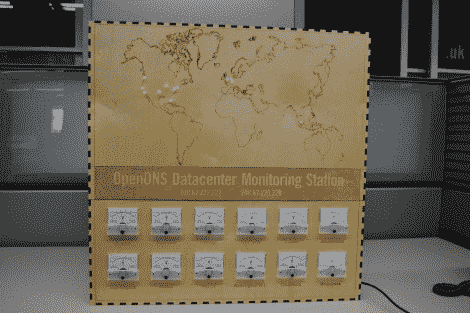

# 使用直接来自战争游戏的显示器监控全球 DNS 状态

> 原文：<https://hackaday.com/2011/07/31/monitoring-the-worlds-dns-status-using-a-display-straight-out-of-wargames/>

没有什么比嵌有发光二极管的工作地图更能说明冷战了。为了更好地测量，再加上一些模拟转盘，你就有了一个可以舒适地安装在每个人都喜欢的 80 年代电脑疯狂电影中 WOPR 旁边的作品。我们认为当[为 OpenDNS](http://www.nerdkraft.com/?p=132) 数据中心监控建立这个状态面板时,【马頔】真的击中了目标。

[马頔]为 OpenDNS 工作，想为即将到来的五周年纪念做些特别的事情。他已经在摆弄用激光切割的木头制作盒子了。这只是一个选择大小的问题，以适应表盘，并留下一个合适的激光蚀刻地图的区域。十二个面板仪表中的每一个都从 Arduino Mega 获得一个 PWM 信号，他用这个信号来激活设备。它显示了基于前一天数据的每个数据中心的比较服务器负载。这些中心在地图上都有一个 LED。现在它们都是红色的，但他使用了 RGB LEDs，并计划很快升级功能。他这样做应该没有问题，因为他采购了一些 TLC5940 驱动程序来扩展他的 I/O 能力。

别忘了检查休息后嵌入的剪辑。

 <https://www.youtube.com/embed/lf-T4aCyWHE?version=3&rel=1&showsearch=0&showinfo=1&iv_load_policy=1&fs=1&hl=en-US&autohide=2&wmode=transparent>

 </body> </html>