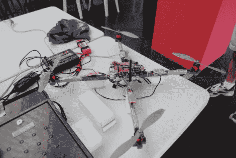

# 基于 Fonera 的四轴飞行器可以通过网络浏览器进行控制

> 原文：<https://hackaday.com/2011/08/01/fonera-based-quadcopter-can-be-controlled-from-a-web-browser/>

[蒂亚克森]刚刚完成了四轴飞行器的建造，由于他使用了意想不到的硬件组合，这引起了我们的兴趣。

直升机的很大一部分是由我们对四旋翼系统的基本要求组成的。然而，[Tiakson]没有使用 Xbee 或 hobby 无线控制器，而是选择使用运行 OpenWRT 的旧 Fonera 路由器来控制系统。他编写了特殊的软件，允许他使用 HTML 5 界面来指挥四轴飞行器，并在此过程中添加了一些内核调整，使他能够通过 GPIO 引脚模拟 I2C 端口。

Fonera 从 Wii nunchuck 和 Motion+传感器接收数据，将命令转发给板载 PIC 16F976 微控制器。PIC 用于管理使用 PWM 的电子速度控制器模块，这是 Fonera 自己无法处理的。

这对于一个老路由器来说用处很大，成本显然远比买现成的无线控制模块便宜。我们很想知道 Fonera 增加了多少额外的重量，以及基于网络的界面是否引入了任何控制器延迟。

继续阅读，观看四轴飞行器的快速演示视频。

 <https://www.youtube.com/embed/Uxwy4beoppk?version=3&rel=1&showsearch=0&showinfo=1&iv_load_policy=1&fs=1&hl=en-US&autohide=2&wmode=transparent>

 </body> </html>