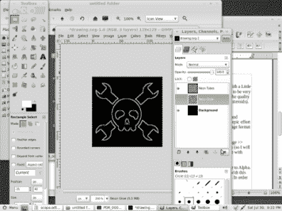
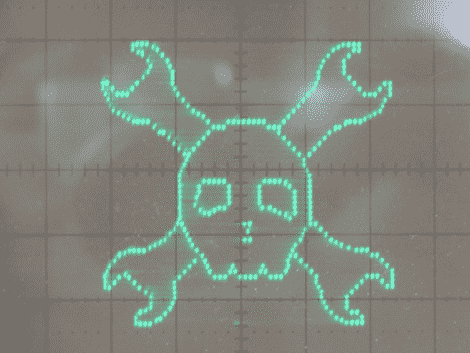

# 想在示波器上玩 Pong 吗？

> 原文：<https://hackaday.com/2011/08/01/want-to-play-pong-on-your-oscilloscope/>

我一直都有！我不知道为什么，但我喜欢使用示波器屏幕作为通用视频显示器的想法。为什么不呢？在我的情况下，它整天坐在我的桌子上，有一个大的屏幕区域，可以进行多种模式的显示，并且非常容易控制。让示波器屏幕为你服务是一个老把戏。外面有很多例子。这还不是一个完成的项目，所以要友好。它实际上相当粗糙，只是一时兴起用了我手头的几个零件。该代码是 ArduincoreGCCish(抱歉，还在学习中)的完美结合，包括以下演示:

1.  简单的低分辨率点画
2.  字体示例
3.  一个写得很快但很糟糕的 pong 演示

该软件在一个时钟频率为 16Mhz 的 Attiny84 微控制器上运行，通过 Attiny 的 USI(通用串行接口)引脚与一个微芯片 MCP42100 双 100k 8 位数字电位计配对。这是一种快速、稳定和精确的安排，但每次想要改变其中一个电位计的值时，都需要发送 16 位，因此它也非常简单。我只是出去玩玩，没有合适的 8 位 DAC。这是一号楼外最接近的东西了。休息之后，请加入我们，观看图片、一个(非常)简短的视频等。

 本项目总分辨率为 256x256x1。这听起来像是一个很大的决心，但不要太兴奋。屏幕上只有几百到 1000 个像素，就会开始严重闪烁。我敢肯定，这个问题可以由不在几乎所有 Arduino 脚本中使用 GCC 命令的人来解决，他们疯狂地试图用没有专用 SPI 的 Attiny 从每个像素的 SPI 端口中挤出 16 或 32 位数据。


我原本以为我会做某种形式的光栅扫描显示，就像电视或电脑显示器一次一列地扫描一行像素。你可以在项目部分的 [electronixandmore](http://www.electronixandmore.com/index.html) 上看到这样的例子，作者将 RS170 电视和 VGA 转换成示波器(还有一堆其他很酷的东西)。也看看最近在 Hackaday 上运行的这个项目:[任天堂游戏机](http://hackaday.com/2011/02/14/nintendoscope/)。在我的小 84 上，扫描每一个像素，然后调整示波器背面的 Z 轴来改变像素亮度，速度非常慢。

好吧，让我们简单点，一些向量线怎么样？我复制了网站的标志，并使用 gimp 的[Web > Image Map]功能很快找到了它。这就吐出了这样一个文件:

```
&lt;img src=&quot;Untitled.bmp&quot; width=&quot;125&quot; height=&quot;120&quot; border=&quot;0&quot; usemap=&quot;#map&quot; /&gt;
&lt;map name=&quot;map&quot;&gt;
&lt;!-- #$-:Image map file created by GIMP Image Map plug-in --&gt;
&lt;!-- #$-:GIMP Image Map plug-in by Maurits Rijk --&gt;
&lt;!-- #$-:Please do not edit lines starting with &quot;#$&quot; --&gt;
&lt;!-- #$VERSION:2.3 --&gt;
&lt;!-- #$AUTHOR:kevin --&gt;
&lt;area shape=&quot;poly&quot; coords=&quot;17,16,36,37,49,66,37,98,20,103,19,48&quot; nohref=&quot;nohref&quot; /&gt;
&lt;/map&gt;
```

通过在那个文件中只画点，我能够产生下面的第一个“图像”。经过一点改进，我在第二张图中产生了一个稍微干净的结果。如你所见，你必须非常注意你的小指针要去哪里，因为它会留下痕迹。我对这些第一次尝试结果的质量不是很满意，尽管这通常是一种非常快速的绘制线框多边形的方法(想想小行星)。

 [](https://hackaday.com/2011/08/01/want-to-play-pong-on-your-oscilloscope/exif-jpeg-46/)  [](https://hackaday.com/2011/08/01/want-to-play-pong-on-your-oscilloscope/exif-jpeg-47/) 

最后我做了一个混音。我不是扫描每一行和每一列，而是只扫描有像素要显示的行和列。这产生了点阵图像。我还需要一个简单的，但不是史诗般的，努力将图像从计算机转换成 AVR。这是使用 gimp、XPM 图像格式和一点点 lua 完成的。

以 Hack a Day 徽标为例，我粗略地裁剪出头骨，然后使用[Image >> Autocrop Image]。接下来我去了[图片>>画布大小]并把它改成了 128×128 的画布。最后，我使用了[图像>>展平图像]和黑色背景。下一步是去除黑色背景。使用[颜色>>颜色到 Alpha]，这很简单。

我可以将它显示为一个实心光栅，但是用这种硬件和软件来制作图像会太慢。我需要去掉大部分像素。为了做到这一点，我用了一个 quickie gimp 作弊，去[滤镜>>阿尔法到 Logo > >霓虹]。现在改变效果大小为 5，发光颜色为白色。最后，删除霓虹发光层，展平。

 [](https://hackaday.com/2011/08/01/want-to-play-pong-on-your-oscilloscope/screenshot-1-6/)  [](https://hackaday.com/2011/08/01/want-to-play-pong-on-your-oscilloscope/screenshot-12/) 

由于我使用的是每像素 1 位的颜色选择，我使用[图像>>模式>>索引]，选择 1 位无抖动。这产生了一个高质量的标志轮廓，但它仍然是沉重的像素。为了减少 ROM 空间和绘图时间，我使用[过滤器>>扭曲>>擦除每隔一行]移除了每隔一行和每隔一列。我想用黑色的背景填充它。我对行做了一次，对列做了一次，偶数或奇数是你的选择，看起来更好。

 [](https://hackaday.com/2011/08/01/want-to-play-pong-on-your-oscilloscope/screenshot-4-2/)  [](https://hackaday.com/2011/08/01/want-to-play-pong-on-your-oscilloscope/screenshot-6-2/) 

我使用 800%的分辨率，用 1 像素的画笔润色所有的图形，并保存为 XPM 格式。XPM 格式是一种基本的文本格式，其中不同的字符代表不同的像素和颜色值。每像素只有 1 比特，你可以非常清楚地看到文本中的图像。

我删除了整个文件头，这样 lua 脚本就可以表达它了。我添加了“strings ={”减号，所以文件看起来像这样:

```

strings = {
“data”,
“data”,
};
```

在括号和分号之后，我添加了下面的 lua:

```

file = io.open(&quot;logo.out&quot;,&quot;w&quot;)
counter = 1;
for y = 1, #strings do
    for x = 1,#strings[y] do
        if string.sub(strings[y], x, x) == &quot;+&quot; then
            file:write(y .. &quot;,&quot;.. x .. &quot;,&quot;)
            counter = counter + 1
        end
    end
end
print(counter*2)
file:close()
```

这会扫描数据并生成一个文件，该文件包含图形中每个白色像素的单行逗号分隔值。它还在命令行中给出一个数字，即 XY 值的像素数* 2。如果你想画任何图形，你需要知道像素的数量，因为程序通过 lua 生成的 CSV 文件循环。它很基本也很大，但是对于这个例子来说已经足够好了。

如果你安装了 lua，通常是“lua filename.ext”，有时是“lua51 filename.ext”，去掉引号。

AvrGCCiberishduino 代码是一个 Arduino 草图，带有 void 设置、void 循环，我使用模拟读取，因为自己实现没有优势。Arduino 对其他 AVR 型号的可扩展性和简化的功能在很多方面都非常好。当你需要发挥速度的时候，它有它的问题。

很快你就会开始摆弄端口寄存器，研究如何使用 USI(通用串行接口)来发送 SPI，因为它比你在软件中做的要快得多。最终，我有了一个只与 attiny84 相关的 Arduino 草图，尽管人们只需要为其他 attiny 如 85 或 2313 更换图钉。与普通 Arduino 上的 Atmegas 一样，Atmegas 需要不同的 SPI 代码来运行。)

```

// System
#include &lt;avr/pgmspace.h&gt;
#define cmdOne 0x11 // write to pot 0(X)
#define cmdTwo 0x12 // write to pot 1(Y)

// Graphics
prog_uchar hadlogo[] PROGMEM ={5,19,5,21,5,23,5,25,5,103,5,105,5,107,5,109,6,27,6,101,7,19,7,29,7,99,7,107,7,109,8,21,9,23,9,31,9,97,9,105,11,25,11,33,11,95,11,103,13,26,13,34,13,94,13,103,15,25,15,35,15,93,15,103,17,23,17,35,17,93,17,105,19,7,19,9,19,21,19,35,19,92,19,107,19,119,19,121,21,7,21,11,21,19,21,36,21,91,21,109,21,117,21,121,23,8,23,13,23,15,23,17,23,37,23,89,23,111,23,113,23,115,23,121,25,9,25,39,25,87,25,119,27,10,27,41,27,85,27,118,29,11,29,43,29,83,29,117,30,13,30,45,30,115,31,15,31,47,31,81,31,113,32,17,32,111,33,19,33,21,33,23,33,25,33,49,33,57,33,59,33,61,33,63,33,65,33,67,33,69,33,71,33,79,33,105,33,107,33,109,34,103,35,27,35,51,35,53,35,55,35,73,35,75,35,77,35,101,36,99,37,29,37,31,37,49,37,77,37,97,39,33,39,47,39,79,39,95,41,35,41,45,41,81,41,93,43,37,43,43,43,83,43,91,45,39,45,41,45,85,45,89,47,40,47,87,49,39,49,87,51,38,51,88,53,37,53,89,55,37,55,47,55,49,55,51,55,53,55,55,55,71,55,73,55,75,55,77,55,89,56,79,57,37,57,45,57,57,57,69,57,81,57,89,59,37,59,45,59,57,59,69,59,83,59,89,61,37,61,44,61,57,61,69,61,83,61,89,63,37,63,57,63,69,63,83,63,89,64,43,65,37,65,53,65,55,65,70,65,73,65,83,65,89,66,45,66,51,66,75,67,37,67,47,67,49,67,77,67,83,67,89,68,79,69,37,69,81,69,89,71,36,71,38,71,63,71,65,71,89,71,91,73,35,73,39,73,87,73,93,74,64,75,33,75,40,75,86,75,95,77,31,77,41,77,63,77,65,77,85,77,97,78,29,78,99,79,27,79,42,79,83,79,101,80,25,80,104,81,17,81,19,81,21,81,23,81,44,81,82,81,107,81,109,81,111,82,15,83,13,83,46,83,81,83,83,83,113,83,115,85,11,85,43,85,47,85,80,85,85,85,117,87,9,87,41,87,48,87,58,87,70,87,80,87,87,87,119,89,8,89,39,89,49,89,57,89,59,89,69,89,71,89,79,89,89,89,121,90,15,91,7,91,13,91,17,91,37,91,51,91,53,91,55,91,61,91,63,91,65,91,67,91,73,91,75,91,77,91,91,91,111,91,113,91,115,91,121,93,7,93,11,93,19,93,35,93,91,93,109,93,117,93,121,95,7,95,9,95,21,95,35,95,92,95,107,95,119,95,121,97,23,97,35,97,93,97,105,99,25,99,35,99,93,99,103,101,25,101,34,101,94,101,103,103,25,103,33,103,95,103,103,104,23,105,21,105,31,105,97,105,105,105,107,107,19,107,29,107,99,107,109,108,27,108,101,109,19,109,21,109,23,109,25,109,103,109,105,109,107,109,109};

// Functions
void qshift(byte input) // using the USI for SPI
{
USIDR = input; // put a byte into the register
USISR = _BV(USIOIF); // clear flag
while ( (USISR &amp; _BV(USIOIF)) == 0 ) // send away
{
USICR = (1&lt;&lt;USIWM0)|(1&lt;&lt;USICS1)|(1&lt;&lt;USICLK)|(1&lt;&lt;USITC);
}
}
void latch(bool state) // toggle CS pin on digipot
{
if(state == 1) PORTA |= (1 &lt;&lt; 3); // raise the latch
else PORTA &amp;=~ (1 &lt;&lt; 3); // lower the latch
}&lt;/p&gt;
void logoscrn() // draw the Hack A Day logo
{
for (int i = 0; i &lt; 674; i += 2)
{
// 0,0 on an image is upper left, on scope its lower left
// subtract pixel Y value from 255 to flip right side up
latch(0); // lower the latch
qshift(cmdTwo); // send the write channel two command
qshift(255 - (64 + pgm_read_byte_near(hadlogo + i))); // send Y data
latch(1); // raise the latch
// image is offset by 64 as it is only has a 128x128 canvas
latch(0); // lower the latch
qshift(cmdOne); // send the write channel one command
qshift(64 + pgm_read_byte_near(hadlogo + (i + 1))); // send X data
latch(1); // raise the latch
}
}
// Arduino Setup
void setup()
{
// set pins of PORTA, PA7 &amp; PA2 as inputs, the rest are outputs&lt;/p&gt;
DDRA = 0x7B;
}
// Arduino Loop
void loop()
{
logoscrn();
}
```



正如你所看到的，这是一个很大的改善图片质量。

其他 2 个演示使用这个基本系统，在引脚 6 和地之间连接一个按钮来切换演示。演示 2 使用一个计数器和一个比例变量从左上角缩放到全尺寸大字体，有 3 行文本和空间再多几行。演示 3 是一个草率的 pong 游戏的开始，对手是一个(愚蠢和神经质的)cpu，没有记分和一个循环球。只需连接一个电位计，一端接地，另一端接地+5，中间连接到 Attiny84 的引脚 11。

 [](https://hackaday.com/2011/08/01/want-to-play-pong-on-your-oscilloscope/exif-jpeg-49/)  [](https://hackaday.com/2011/08/01/want-to-play-pong-on-your-oscilloscope/exif-jpeg-50/)  [](https://hackaday.com/2011/08/01/want-to-play-pong-on-your-oscilloscope/scn_0002/) 

[Software.zip](http://cheesefactory.us/filecenter/hadimg/code.zip) 你需要一个程序员，Arduino 或 Arduino 内核，以及 [Arduino Tiny](http://code.google.com/p/arduino-tiny/)

不幸的是，现在我不得不离开这个想法，但是请担心我会很快回来！

 <https://www.youtube.com/embed/lqy76Bh4CDk?version=3&rel=1&showsearch=0&showinfo=1&iv_load_policy=1&fs=1&hl=en-US&autohide=2&wmode=transparent>

</span></p> </body> </html>