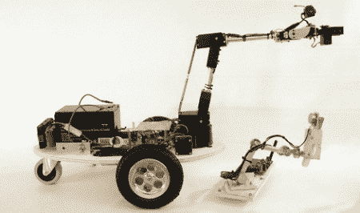

# 机器人园丁从拆弹机器人那里得到启示

> 原文：<https://hackaday.com/2011/08/01/robotic-gardener-takes-its-cue-from-bomb-disposal-bots/>

[Dave]在 Propeller 论坛上发布了一些他的“Nuntius”机器人[的图片和视频。从图片上看，这是一个令人印象深刻的建筑，但要真正欣赏[戴夫]的技能，](http://forums.parallax.com/showthread.php?132860-Nuntius-The-Garden-Avender-Robot-now-with-video)[看看 Youtube 上的演示](http://www.youtube.com/watch?v=RnZ_UmJkjqs#t=15)。

[控制器](http://hackaday.com/wp-content/uploads/2011/07/nuntius-controller.jpg)是一个螺旋桨原型板，用一些角铝固定在一起。花盆被放置在遥控器手臂的关节处，这样机器人的手臂就可以反映遥控器的形状。我们通常看到通过[电脑](http://hackaday.com/2011/07/25/singing-robot/)控制的 [Armatron](http://www.theoldrobots.com/armatron1.html) 机器人，或者在人类控制的罕见情况下，[鼠标](http://hackaday.com/2010/07/22/mouse-controlled-manipulator-arm/)。[Dave]的版本可能是我们在 Hack A Day 上看到的第一个远程操纵器版本。

在机器人方面，另一个螺旋桨板、电机和伺服系统都由 12 V 摩托车电池供电。连接到机械手末端的是一个廉价的 2.4 Ghz 无线摄像头，[戴夫]说它让你感觉像在电影《深渊》中一样。虽然我们怀疑这个机器人是否会非常适合水下探索，但它看起来确实像我们见过的一些[拆弹机器人](http://www.defencetalk.com/bomb-disposal-robot-put-to-work-in-afghanistan-23733/)。