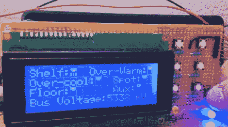

# 车间的灯太亮了，会晒伤你的

> 原文：<https://hackaday.com/2011/08/01/workshop-lights-so-bright-they-will-give-you-sunburn/>

没有什么比试图用次优的照明来修补你的工作台更令人沮丧的了。一天下午，【杰里米】正在他的工作室里辛苦工作，这时[他决定他终于受够了](http://thecustomgeek.com/?p=17)，并着手检查他的照明设置。

他的工作室现在亮得令人难以置信，架子下面有几个 CCFL 管，以补充安装在天花板上的冷热混合发光二极管。我们非常喜欢他的设置的一点是，他在工作台底部增加了一些 led，对准地板——非常适合一个小螺钉或 SMD 元件丢失的时候。

一切都由他塞进项目箱的 ATMega 328 控制，允许他使用几个简单的按钮和一个小液晶面板来调整照明以适应他的需要。

[杰里米]说，整个事情是“矫枉过正”，这无疑是他做过的最乱的布线工作。对于一个下午匆匆拼凑起来的东西，我们觉得刚刚好。我们唯一缺少的就是一些图表和源代码。

至于过分的评论，跟我一起说:那里。加拿大从来没有。是。也是。很多。发光二极管！

留下来观看[杰里米]演示该系统如何运作。

[via [Adafruit 博客](http://www.adafruit.com/blog/2011/07/31/workbench-light-controller/)

 <https://www.youtube.com/embed/CIJ_IDWS5T4?version=3&rel=1&showsearch=0&showinfo=1&iv_load_policy=1&fs=1&hl=en-US&autohide=2&wmode=transparent>

 </body> </html>