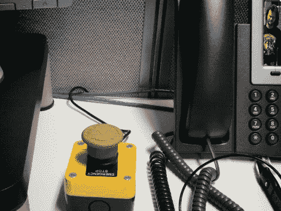

# 这里有个按钮，给关心的人打电话…

> 原文：<https://hackaday.com/2011/08/01/heres-a-button-call-someone-who-cares/>

[Les]手边有数千美元昂贵的 IP 电话基础设施，所以他想他也可以玩一玩——毕竟，如果你不能享受一点乐趣，那些设备又有什么用呢？

受到 Make 上的“牛逼按钮”[的启发，他开始思考自己想要什么样的按钮功能。他一定是在开始创作的那一天脑子里就有了](http://blog.makezine.com/archive/2011/04/the-awesome-button.html)[崔维斯·崔特](http://www.youtube.com/watch?v=29ebiwO4O70&)，因为他把它命名为“呼叫关心他的人按钮”。

[Les]从易贝拿起一个“紧急停止”按钮，将其连接到一个 TeensyUSB，就像在 Make 文章中所做的那样。他将按钮映射到 pause/break 键，然后编写了一段 C #代码来监听该键的按下。当按钮被拨动时，会发生一系列事件，让他的老板尽快接通电话。

这是一个有趣的小项目，虽然我可能已经建立了一个按钮，在转储呼叫之前将假静电和回声引入到线路中，但我认为它仍然非常酷。

因为似乎每个人都有一些令人敬畏的按钮，在评论中与我们分享你的，一定要留下来看看 CSWC 按钮的快速视频演示。

[https://www.youtube.com/embed/qLzkUqZnaNA?version=3&rel=1&showsearch=0&showinfo=1&iv_load_policy=1&fs=1&hl=en-US&autohide=2&wmode=transparent](https://www.youtube.com/embed/qLzkUqZnaNA?version=3&rel=1&showsearch=0&showinfo=1&iv_load_policy=1&fs=1&hl=en-US&autohide=2&wmode=transparent)