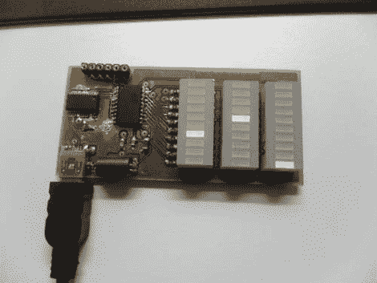

# 微型外接系统显示器让您轻松监控您的电脑

> 原文：<https://hackaday.com/2011/08/02/tiny-external-system-monitor-makes-it-easy-to-keep-tabs-on-your-pc/>

Instructables 用户[Jan]喜欢密切关注他的计算机的内存使用情况，但希望看到比标准资源管理器更有趣的东西。他希望有一个外部显示器，可以快速显示他的计算机的状态，因此这种系统监视器诞生了。

他的状态面板包含三个不断更新的 LED 条，显示他的计算机的 CPU 使用率、可用物理内存和虚拟内存消耗。由于优先考虑小尺寸，因此[Jan]通过使用 SMD 元件以及将板载 UART 转 USB 转换器与 ATTiny 微控制器一起使用，使指示器的尺寸变小。

他使用 Python 脚本从自己的电脑上收集使用信息，通过 USB 传输到显示器上。正如你在下面的视频中所看到的，该系统工作得非常好，尽管虚拟内存指示器似乎没有太多的动作——也许它可以用来指示硬盘驱动器的活动。

如果你想建造类似的东西，[Jan]已经把他所有的代码和原理图提供给任何人使用。

[https://www.youtube.com/embed/LU2NwO662H4?version=3&rel=1&showsearch=0&showinfo=1&iv_load_policy=1&fs=1&hl=en-US&autohide=2&wmode=transparent](https://www.youtube.com/embed/LU2NwO662H4?version=3&rel=1&showsearch=0&showinfo=1&iv_load_policy=1&fs=1&hl=en-US&autohide=2&wmode=transparent)