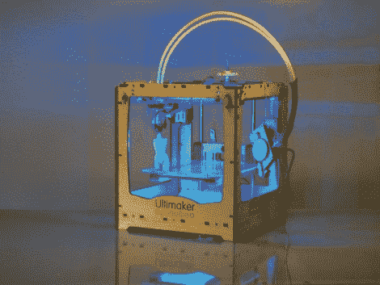

# 使用 Ultimaker 实现惊人的快速 3D 打印

> 原文：<https://hackaday.com/2011/08/02/incredibly-fast-3d-printing-with-the-ultimaker/>

有一款新的 3d 打印机上市了，真他妈的快！

来自荷兰的 Ultimaker 3D 打印机终于登陆美国，旨在向 MakerBot 发起挑战。Ultimaker 由乌特勒支 Fab Lab 经理 Siert Wijnia 和两位实验室常客 Erik DeBruijn 和 Martijn Elserman 共同设计。这三人是 MakerBot 的忠实粉丝，但他们想制造一台更好的 3D 打印机。

制造更好的打印机，他们做到了。

Ultimaker 可以像 MakerBot 一样使用 ABS 或 PLA 塑料打印，但它比它的前辈快几个数量级。MakerBot 使用移动构建平台，而 Ultimaker 有一个可以沿三个轴移动的打印头。移动的打印头，以及安装在打印机框架上的胶印机马达，使 Ultimaker 能够以更高的速度制造比 MakerBot 更高的物体。

这并不是说 MakerBot 在任何方面都不好——相反，一个新成员的出现表明了开源设计的发展和进步如何让我们所有人受益。

继续阅读，看看 Ultimaker 的视频，你不会后悔的！

 <https://www.youtube.com/embed/A2cgGTLMeCQ?version=3&rel=1&showsearch=0&showinfo=1&iv_load_policy=1&fs=1&hl=en-US&autohide=2&wmode=transparent>

 </body> </html>