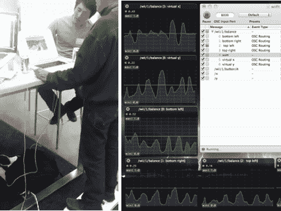

# 使用 Wii 平衡板的虚拟赛格威旅游

> 原文：<https://hackaday.com/2011/08/02/virtual-segway-tours-using-the-wii-balance-board/>

足不出户，畅游世界各地。这款[虚拟 Segway tour](http://www.quora.com/Stormy-Shippy/Virtual-Segway-tours-with-a-Wii-Fit-balance-board) 使用 Wii Fit 平衡板和谷歌地球，让驾驶者通过向他们想要旅行的方向倾斜来控制虚拟旅行。它是 Hackspace 的一次黑客马拉松的产物，这是斯坦福大学黄工程中心的一个新的黑客空间。

这个项目由当晚刚认识的四个人承担。七个小时后，他们有了一个结合了大量软件包的工作系统；OS X、接触者、Node.js、Socket.io、谷歌地球 API、怪物牛奶车和谷歌 3D 仓库。这些软件包中的大部分是用来让电路板与计算机对话，然后解释数据。怪物牛奶车——我们从未听说过——是一个插件，让你通过按钮和箭头(由平衡板数据翻译模拟)在谷歌地球环境中驾驶。

这是对我们见过的其他一些平衡板黑客的一个很好的补充，比如用来控制魔兽世界的那个。休息后别忘了偷看视频。

 <https://www.youtube.com/embed/Jnsxsn2CZFo?version=3&rel=1&showsearch=0&showinfo=1&iv_load_policy=1&fs=1&hl=en-US&autohide=2&wmode=transparent>

 </body> </html>